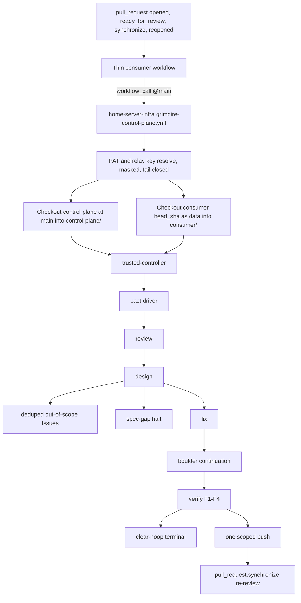

# Grimoire Reusable Control Plane

This guide explains the reusable Grimoire control plane now packaged in `home-server-infra`. It has two audiences.

Maintainers use it to understand the loop architecture, public package boundary, safety gates, and release state without reading the implementation.

Consumer repo owners use it to copy the thin caller workflow, set required secrets and access, and know how to stop or roll back the bot.

## Source Of Truth

`home-server-infra` owns the reusable Grimoire control plane. Consumer repositories call it, but they don't vendor stage actions, helper scripts, OpenCode config, OMO config, schemas, or runtime policy.

This is Grimoire opencode and OMO relocation from the `rs-builder-relayer-client` pilot. It is not a Codex rollback. `home-server-infra` PR #53, commit `8ed807f6b6d3676b001164dc2116bf87f117d69b`, removed the old Codex loop. Grimoire keeps a different stage contract and a different source-of-truth boundary.

Private consumers intentionally follow `home-server-infra/main`. Updates to `home-server-infra/main` propagate to consumers that call the reusable workflow on `@main`. That is the private consumer policy, not an accidental loose ref.

## Recovered Stage Map

The recovered loop order is exact:

1. `trusted-controller`
2. `review`
3. `design`
4. file deduped out-of-scope Issues after design classification
5. `spec-gap` or `fix`
6. boulder continuation
7. `verify` F1-F4
8. terminate, or loop through one scoped push and the next `pull_request.synchronize`

The implementation stage actions are:

| Order | Stage | Contract |
| --- | --- | --- |
| 1 | `trusted-controller` | Runs from trusted base control-plane code, checks protected paths, and decides allowed model, write, commit, push, and GitHub mutation capabilities. |
| 2 | `review` | Read-only four-lens review. It gathers findings and never edits, comments, labels, commits, or pushes. |
| 3 | `design` | Prometheus plus OpenSpec and OMO binding. It classifies findings as in-scope or out-of-scope and halts if in-scope evidence is insufficient. |
| 4 | `spec-gap` | Renders the five-section OpenSpec insufficiency halt artifact when in-scope evidence is missing. |
| 5 | `fix` | Prepares the Atlas `/start-work` handoff, enforces the scope guard, and emits `clear-noop`, `fixed`, or a fail-closed status. |
| 6 | `verify` | Emits the F1-F4 JSON verdict. All four fields must be `APPROVE` for terminal cast or scoped push. |
| 7 | `labels` | Applies display-only label transitions. Labels are never machine state. |
| 8 | `cast` | Drives stage sequencing, out-of-scope Issue filing, boulder continuation, termination, and fixed-push re-review. |

Terminal behavior is:

1. `clear-noop` plus all F1-F4 `APPROVE` means terminal cast with no commit and no push.
2. `fixed` plus all F1-F4 `APPROVE` means one scoped bot commit and push, then a `pull_request.synchronize` re-review.
3. Any reject, malformed verdict, missing evidence, protected path halt, scope violation, missing credential, or incomplete boulder result fails closed.

## Visual Architecture



The called workflow's `github` context is associated with the caller. For that reason, checkout is explicit and split. The control plane is checked out as `DongwonTTuna-Labs/home-server-infra@main` into `control-plane/`. The consumer repository is checked out at `head_sha` into `consumer/` and is treated as PR-head data. Both checkouts use `persist-credentials: false`.

## Package Path Map

The package layout is:

| Purpose | Path |
| --- | --- |
| Thin reusable orchestrator | `.github/workflows/grimoire-control-plane.yml` |
| Trusted controller action | `actions/grimoire/trusted-controller/action.yml` |
| Review action | `actions/grimoire/review/action.yml` |
| Design action | `actions/grimoire/design/action.yml` |
| Spec-gap action | `actions/grimoire/spec-gap/action.yml` |
| Fix action | `actions/grimoire/fix/action.yml` |
| Verify action | `actions/grimoire/verify/action.yml` |
| Labels action | `actions/grimoire/labels/action.yml` |
| Cast driver action | `actions/grimoire/cast/action.yml` |
| Action-local helpers | `actions/grimoire/<stage>/scripts/*` |
| OpenCode runtime policy | `config/grimoire/opencode.json` |
| OMO runtime policy | `config/grimoire/oh-my-openagent.jsonc` |
| Workflow-call schema | `schemas/grimoire-workflow-call.v1.schema.json` |
| Workflow contract test | `tests/grimoire_workflow_contract_test.py` |
| Action contract test | `tests/grimoire_action_contract_test.py` |
| Stage contract test | `tests/grimoire_stage_contract_test.py` |
| Secret hygiene test | `tests/grimoire_secret_hygiene_test.py` |
| Doc contract test | `tests/grimoire_doc_contract_test.py` |
| Consumer adapter validator | `tests/validate_consumer_adapter.py` |
| Operator guide | `docs/grimoire-reusable.md` |
| ADR | `docs/decisions/grimoire-reusable-control-plane.md` |

The reusable workflow is a thin `workflow_call` orchestrator. The eight stage actions own stage logic. Helper files under `actions/grimoire/<stage>/scripts/` are action-local implementation details. They are not public API, not consumer extension points, and not a flat runtime script surface. There is no top-level `scripts/grimoire/` runtime package.

## Consumer Policy

Consumers keep one thin workflow. Copy this file into the consumer repository, usually as `.github/workflows/grimoire.yml`.

<!-- grimoire-consumer-workflow:recommended:start -->
```yaml
name: Grimoire

on:
  pull_request:
    types: [opened, ready_for_review, synchronize, reopened]

permissions: {}

jobs:
  grimoire:
    if: ${{ github.event.pull_request.draft == false && !contains(github.event.pull_request.labels.*.name, 'LGTM') }}
    uses: DongwonTTuna-Labs/home-server-infra/.github/workflows/grimoire-control-plane.yml@main
    with:
      consumer_repository: ${{ github.repository }}
      consumer_ref: ${{ github.event.pull_request.head.ref }}
      pull_request_number: ${{ github.event.pull_request.number }}
      head_sha: ${{ github.event.pull_request.head.sha }}
      base_ref: ${{ github.event.pull_request.base.ref }}
    secrets:
      GRIMOIRE_PAT: ${{ secrets.GRIMOIRE_PAT }}
      AI_RELAY_API_KEY: ${{ secrets.AI_RELAY_API_KEY }}
      CF_ACCESS_CLIENT_ID: ${{ secrets.CF_ACCESS_CLIENT_ID }}
      CF_ACCESS_CLIENT_SECRET: ${{ secrets.CF_ACCESS_CLIENT_SECRET }}
```
<!-- grimoire-consumer-workflow:recommended:end -->

Required caller behavior:

1. Use only the `pull_request` event with types `[opened, ready_for_review, synchronize, reopened]`.
2. Keep top-level `permissions: {}` in the consumer caller.
3. Keep the job-level guard for non-draft PRs and the absence of the `LGTM` stop label.
4. Call `DongwonTTuna-Labs/home-server-infra/.github/workflows/grimoire-control-plane.yml@main`.
5. Pass `consumer_repository`, `consumer_ref`, `pull_request_number`, `head_sha`, and `base_ref` from GitHub pull request metadata.
6. Map named secrets explicitly. Don't use `secrets: inherit`.

The reusable workflow also accepts optional `grimoire_contract_version` with default `"1"`. Consumers normally omit it. If a future version requires explicit selection, the release notes for that version will say so.

### Consumer Access Setup

Private reusable workflow access has two gates.

1. In the called private repository, `home-server-infra`, a maintainer must enable access under Settings, Actions, General, Access.
2. In the caller repository, the Actions policy must allow private reusable workflows and actions from the organization.

If GitHub says the workflow can't be found or isn't reusable, check those gates first. Then confirm the caller uses `@main`, the called file lives directly under `.github/workflows/`, and the called workflow has `on.workflow_call`.

### Required Secrets And Runner Access

Grimoire uses a PAT-only auth model for privileged GitHub operations.

1. Preferred GitHub auth is the named consumer secret `GRIMOIRE_PAT`.
2. If that named secret is absent, the self-hosted runner may provide `CODEX_LOOP_PAT` as a bounded fallback.
3. If neither is present, the workflow fails closed before checkout, Issues, labels, or push stages.
4. Preferred model relay auth is the named consumer secret `AI_RELAY_API_KEY`.
5. If that named secret is absent, the runner may provide `AI_RELAY_API_KEY` from its environment.
6. Cloudflare Access for the AI relay uses named consumer secrets `CF_ACCESS_CLIENT_ID` and `CF_ACCESS_CLIENT_SECRET`.
7. If either Cloudflare Access named secret is absent, the runner may provide the same-name `CF_ACCESS_CLIENT_ID` or `CF_ACCESS_CLIENT_SECRET` environment variable.
8. If no relay key is present, or either Cloudflare Access value is absent, the workflow fails closed before model-capable stages.
9. OpenCode receives those Cloudflare Access values only as provider headers `CF-Access-Client-Id` and `CF-Access-Client-Secret` from environment-backed config.
10. Resolved credentials are masked before use. Docs, logs, fixtures, comments, and evidence must never include raw secrets, prefixes, lengths, hashes, token-bearing URLs, or private run URLs.

The reusable workflow runs on self-hosted infrastructure only:

```yaml
runs-on:
  group: Home Server Runners
  labels: dongwontuna-labs-runner
```

The reusable workflow keeps top-level `permissions: {}` and grants only explicit job permissions currently needed for checkout.

### Stop And Rollback Signals

To stop Grimoire on a PR, add the `LGTM` label. The consumer job guard skips PRs with that label.

To roll back a consumer repository to no Grimoire automation, remove the thin caller workflow from that consumer repo. Don't change the reusable control plane for a per-consumer stop.

A scoped bot push from Grimoire never means rollout is complete. It means the fixed path reached F1-F4 approval and pushed one scoped commit, then GitHub must emit a fresh `pull_request.synchronize` event for re-review.

## Security And Auth

Credentialed Grimoire execution never trusts PR-head runtime policy.

The reusable workflow checks out the trusted control plane separately and calls local actions through `./control-plane/actions/grimoire/...`. Consumer code is data under `consumer/`. PR-head `.opencode`, root `opencode.json`, local actions, scripts, package lifecycle hooks, and plugins are not trusted under model or write credentials.

Do not use these as valid Grimoire patterns:

1. `secrets: inherit`
2. `pull_request_target`
3. `GITHUB_TOKEN` for privileged Grimoire GitHub operations
4. GitHub App token auth for Grimoire privileged writes
5. GitHub-hosted runner fallback
6. Manual dispatch triggers or a separate manual Grimoire workflow
7. Consumer-provided runtime control inputs that change execution mode or pretend to run live behavior
8. SHA, tag, or non-main branch refs for this private reusable workflow

### Invalid Examples, Not Recommended

Invalid example, do not copy, SHA ref:

```yaml
jobs:
  grimoire:
    uses: DongwonTTuna-Labs/home-server-infra/.github/workflows/grimoire-control-plane.yml@0123456789abcdef0123456789abcdef01234567
```

Invalid example, do not copy, tag ref:

```yaml
jobs:
  grimoire:
    uses: DongwonTTuna-Labs/home-server-infra/.github/workflows/grimoire-control-plane.yml@v1.0.0
```

Invalid example, do not copy, inherited secrets:

```yaml
jobs:
  grimoire:
    uses: DongwonTTuna-Labs/home-server-infra/.github/workflows/grimoire-control-plane.yml@main
    secrets: inherit
```

Invalid example, do not copy, GitHub-hosted fallback:

```yaml
jobs:
  grimoire:
    runs-on: ubuntu-latest
```

Invalid example, do not copy, `GITHUB_TOKEN` auth:

```yaml
jobs:
  grimoire:
    uses: DongwonTTuna-Labs/home-server-infra/.github/workflows/grimoire-control-plane.yml@main
    secrets:
      GRIMOIRE_PAT: ${{ secrets.GITHUB_TOKEN }}
```

Invalid example, do not copy, `pull_request_target`:

```yaml
on:
  pull_request_target:
```

Invalid example, do not copy, runtime controls:

```yaml
with:
  mode: live
  dry_run: false
  allow_live: true
  simulate: false
```

## Scope Guard

OpenSpec and OMO define the active work boundary. During relocation, the current Grimoire plan items fill the gap until active OpenSpec changes exist.

`design` is the scope authority. It receives read-only review findings, binds them to active OpenSpec or OMO scope, and emits an in-scope and out-of-scope split. Out-of-scope findings are filed as short GitHub Issues right after design, with a stable dedup fingerprint, redacted text, affected repo or path, and suggested owner or label. That write is Issues-only and never touches PR-head files. In short, out-of-scope findings are filed, not fixed in-loop.

The loop must not fix out-of-scope findings. It must not use private log excerpts, raw token values, secret prefixes, secret lengths, or secret hashes in Issues, comments, docs, or evidence.

## Runtime Policy

There is no runtime simulation input and no separate manual Grimoire workflow. The loop is always-on for eligible pull requests and is controlled by:

1. Pull request trigger types `[opened, ready_for_review, synchronize, reopened]`
2. Job-level Ready-only and non-`LGTM` gate
3. `LGTM` stop label
4. Trusted-controller protected-path guard
5. OpenSpec and OMO scope guard
6. F1-F4 verification gate
7. Wall-clock boulder liveness guard
8. Scoped push filter that excludes `.omo/**`

Local deterministic contract tests provide pre-rollout evidence. A real cross-repo pull request event is a later task after `home-server-infra` is merged and private reusable workflow access is enabled. Task 9 is the first place to claim observed real cross-repo PR-event execution.

## Release Notes

The first reusable Grimoire package release note is `docs/releases/grimoire-reusable-control-plane-v1.md`.

That release note records the relocated Grimoire loop, PR #53 context, contract and fixture evidence, secret hygiene evidence, the private access gate, and the next consumer migration step. It also states that this package is not a Codex rollback, has no runtime simulation or manual workflow, and has no live rollout claim yet.

## Non-Goals

This package doesn't make Grimoire a public GitHub Action marketplace surface.

This package doesn't let consumers override stage actions, helper scripts, model policy, OMO policy, or runtime controls.

This package doesn't claim production rollout, live Grimoire capability, or cross-repo execution evidence. Those claims need a later observed PR-event run after human merge and private access setup.
