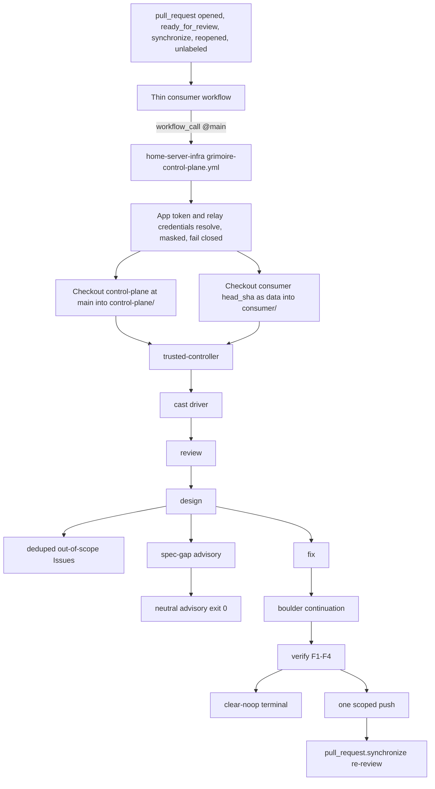

# Grimoire Reusable Control Plane

This guide explains the reusable Grimoire control plane now packaged in `home-server-infra`. It has two audiences.

Maintainers use it to understand the loop architecture, public package boundary, safety gates, and release state without reading the implementation.

Consumer repo owners use it to copy the thin caller workflow, set required secrets and access, and know how to stop or roll back the bot.

## Source Of Truth

`home-server-infra` owns the reusable Grimoire control plane. Consumer repositories call it, but they don't vendor stage actions, helper scripts, OpenCode config, OMO config, schemas, or runtime policy.

This is Grimoire opencode and OMO relocation from the `rs-builder-relayer-client` pilot. It is not a Codex rollback. `home-server-infra` PR #53, commit `8ed807f6b6d3676b001164dc2116bf87f117d69b`, removed the old Codex loop. Grimoire keeps a different stage contract and a different source-of-truth boundary.

Private consumers intentionally follow `home-server-infra/main`. Updates to `home-server-infra/main` propagate to consumers that call the reusable workflow on `@main`. That is the private consumer policy, not an accidental loose ref.

## Recovered Stage Map

The recovered loop order is exact:

1. `trusted-controller`
2. `review`
3. `design`
4. file deduped out-of-scope Issues after design classification
5. `spec-gap` advisory or `fix`
6. boulder continuation
7. `verify` F1-F4
8. terminate, return advisory, or loop through one scoped push and the next `pull_request.synchronize`

The implementation stage actions are:

| Order | Stage | Contract |
| --- | --- | --- |
| 1 | `trusted-controller` | Runs from trusted base control-plane code, checks protected paths, and decides allowed model, write, commit, push, and GitHub mutation capabilities. |
| 2 | `review` | Read-only four-lens review. It gathers findings and never edits, comments, labels, commits, or pushes. |
| 3 | `design` | Prometheus plus OpenSpec and OMO binding. It classifies findings as in-scope or out-of-scope, applies severity-threshold or valid scope-manifest gating, leaves advisory gaps non-blocking, and still fails red for real safety gaps. |
| 4 | `spec-gap` | Renders the five-section OpenSpec advisory when spec evidence guidance is needed. It sets `advisory=true` and `no_code_or_push_action=true`; it doesn't authorize code changes or push. |
| 5 | `fix` | Prepares the Atlas `/start-work` handoff, enforces the scope guard, and emits `clear-noop`, `fixed`, or a fail-closed status. |
| 6 | `verify` | Emits the F1-F4 JSON verdict. All four fields must be `APPROVE` for terminal cast or scoped push. |
| 7 | `labels` | Applies display-only label transitions. Labels are never machine state. |
| 8 | `cast` | Drives stage sequencing, out-of-scope Issue filing, boulder continuation, termination, advisory completion, and fixed-push re-review. |

Terminal behavior is:

1. `clear-noop` plus all F1-F4 `APPROVE` means terminal cast with no commit and no push.
2. `fixed` plus all F1-F4 `APPROVE` means one scoped bot commit and push, then a `pull_request.synchronize` re-review.
3. `spec-gap` advisory and strict `no-actionable-work` are neutral completions. They exit 0, perform no code action or push, and return advisory status for display.
4. Protected path halt, unsafe target, malformed verdict, scope violation, push failure, missing credential, incomplete boulder result, and high-safety missing evidence still fail closed.

Specs are still expected. Advisory spec-gap means non-blocking guidance for the current PR event, not permission to skip or falsify OpenSpec evidence.

## Outcome Taxonomy

The cast driver writes one `conclusion` for each path. Consumers and presentation layers should read artifacts, not labels, for machine state.

| Conclusion | Decisions | Final status | Process exit | Label intent and action |
| --- | --- | --- | --- | --- |
| `success` | `clear-noop-terminal` or scoped push after F1-F4 approval | `terminal` for clear-noop, `awaiting-synchronize` after the one scoped push | 0 | Normal `done` or `keep-running` label intent. |
| `neutral` | `spec-gap-halt` advisory or strict `no-actionable-work` | `advisory` | 0 | No code action, no push, and `spec-needed` where OpenSpec guidance is relevant. |
| `failure` | Protected path, unsafe target, malformed verdict, scope violation, push failure, missing credential, incomplete boulder, or other fail-closed safety path | `fizzled` | 1 | `fizzled` label intent. |

`spec-gap-halt` keeps the compatible decision string for downstream readers. It now carries `conclusion="neutral"`, `exit_code=0`, `status="ok"`, label intent `spec-needed`, `should_push=false`, and `terminal=false`.

The spec-gap stage artifact still keeps compatibility fields such as `status="halt"` and `should_halt=true`, but marks the event as advisory and emits `no_code_or_push_action=true`. The cast layer is what turns that compatible stage signal into a neutral process completion.

## Visual Architecture



The called workflow's `github` context is associated with the caller. For that reason, checkout is explicit and split. The control plane is checked out as `DongwonTTuna-Labs/home-server-infra@main` into `control-plane/`. The consumer repository is checked out at `head_sha` into `consumer/` and is treated as PR-head data. Both checkouts use `persist-credentials: false`.

## Package Path Map

The package layout is:

| Purpose | Path |
| --- | --- |
| Thin reusable orchestrator | `.github/workflows/grimoire-control-plane.yml` |
| Trusted controller action | `actions/grimoire/trusted-controller/action.yml` |
| Review action | `actions/grimoire/review/action.yml` |
| Design action | `actions/grimoire/design/action.yml` |
| Spec-gap action | `actions/grimoire/spec-gap/action.yml` |
| Fix action | `actions/grimoire/fix/action.yml` |
| Verify action | `actions/grimoire/verify/action.yml` |
| Labels action | `actions/grimoire/labels/action.yml` |
| Cast driver action | `actions/grimoire/cast/action.yml` |
| Action-local helpers | `actions/grimoire/<stage>/scripts/*` |
| OpenCode runtime policy | `config/grimoire/opencode.json` |
| OMO runtime policy | `config/grimoire/oh-my-openagent.jsonc` |
| Workflow-call schema | `schemas/grimoire-workflow-call.v1.schema.json` |
| Scope manifest schema | `schemas/grimoire-scope.v1.schema.json` |
| Workflow contract test | `tests/grimoire_workflow_contract_test.py` |
| Action contract test | `tests/grimoire_action_contract_test.py` |
| Stage contract test | `tests/grimoire_stage_contract_test.py` |
| Secret hygiene test | `tests/grimoire_secret_hygiene_test.py` |
| Doc contract test | `tests/grimoire_doc_contract_test.py` |
| Consumer adapter validator | `tests/validate_consumer_adapter.py` |
| Operator guide | `docs/grimoire-reusable.md` |
| Primary ADR | `docs/decisions/grimoire-reusable-control-plane.md` |
| GitHub App auth ADR | `docs/decisions/grimoire-app-auth.md` |
| Advisory and failure ADR | `docs/decisions/grimoire-advisory-failure-separation.md` |
| v1 release notes | `docs/releases/grimoire-reusable-control-plane-v1.md` |
| v1 advisory and failure release notes | `docs/releases/grimoire-reusable-control-plane-v1-advisory-failure.md` |
| v1 GitHub App auth release notes | `docs/releases/grimoire-app-auth-v1.md` |

The reusable workflow is a thin `workflow_call` orchestrator. The eight stage actions own stage logic. Helper files under `actions/grimoire/<stage>/scripts/` are action-local implementation details. They are not public API, not consumer extension points, and not a flat runtime script surface. There is no top-level `scripts/grimoire/` runtime package.

## Consumer Policy

Consumers keep one thin workflow. Copy this file into the consumer repository, usually as `.github/workflows/grimoire.yml`.

<!-- grimoire-consumer-workflow:recommended:start -->
```yaml
name: Grimoire

on:
  pull_request:
    types: [opened, ready_for_review, synchronize, reopened, unlabeled]

permissions: {}

jobs:
  grimoire:
    if: >-
      ${{
        github.event.pull_request.draft == false &&
        !contains(github.event.pull_request.labels.*.name, 'grimoire:disabled') &&
        (github.event.action != 'unlabeled' || github.event.label.name == '📋 Spec Needed')
      }}
    uses: DongwonTTuna-Labs/home-server-infra/.github/workflows/grimoire-control-plane.yml@main
    with:
      consumer_repository: ${{ github.repository }}
      consumer_ref: ${{ github.event.pull_request.head.ref }}
      pull_request_number: ${{ github.event.pull_request.number }}
      head_sha: ${{ github.event.pull_request.head.sha }}
      base_ref: ${{ github.event.pull_request.base.ref }}
      grimoire_app_client_id: Iv23liFL1dDHmU06FLSF
    secrets:
      GRIMOIRE_APP_PRIVATE_KEY: ${{ secrets.GRIMOIRE_APP_PRIVATE_KEY }}
      AI_RELAY_API_KEY: ${{ secrets.AI_RELAY_API_KEY }}
      CF_ACCESS_CLIENT_ID: ${{ secrets.CF_ACCESS_CLIENT_ID }}
      CF_ACCESS_CLIENT_SECRET: ${{ secrets.CF_ACCESS_CLIENT_SECRET }}
```
<!-- grimoire-consumer-workflow:recommended:end -->

`pull_request.unlabeled` is only for re-review after a human removes `📋 Spec Needed`. The job guard prevents non-Spec-Needed label removals from triggering Grimoire.

Required caller behavior:

1. Use only the `pull_request` event with types `[opened, ready_for_review, synchronize, reopened, unlabeled]`.
2. Keep top-level `permissions: {}` in the consumer caller.
3. Keep the job-level guard for non-draft PRs, the absence of the `grimoire:disabled` stop label, and `unlabeled` events limited to `📋 Spec Needed` removals.
4. Call `DongwonTTuna-Labs/home-server-infra/.github/workflows/grimoire-control-plane.yml@main`.
5. Pass `consumer_repository`, `consumer_ref`, `pull_request_number`, `head_sha`, and `base_ref` from GitHub pull request metadata, plus non-secret `grimoire_app_client_id`.
6. Map named secrets explicitly, including `GRIMOIRE_APP_PRIVATE_KEY`. Don't use `secrets: inherit`.

The reusable workflow also accepts optional `grimoire_contract_version` with default `"1"`. Consumers normally omit it. If a future version requires explicit selection, the release notes for that version will say so.

### Consumer Access Setup

Private reusable workflow access has two gates.

1. In the called private repository, `home-server-infra`, a maintainer must enable access under Settings, Actions, General, Access.
2. In the caller repository, the Actions policy must allow private reusable workflows and actions from the organization.

If GitHub says the workflow can't be found or isn't reusable, check those gates first. Then confirm the caller uses `@main`, the called file lives directly under `.github/workflows/`, and the called workflow has `on.workflow_call`.

### Required Secrets And Runner Access

Grimoire uses GitHub App installation token auth for privileged GitHub operations.

1. Current GitHub auth is the named consumer secret `GRIMOIRE_APP_PRIVATE_KEY` plus non-secret `grimoire_app_client_id`.
2. The default Grimoire App client ID is `Iv23liFL1dDHmU06FLSF`.
3. The reusable workflow mints one installation token with `actions/create-github-app-token@fee1f7d63c2ff003460e3d139729b119787bc349`, `client-id: ${{ inputs.grimoire_app_client_id }}`, `private-key: ${{ secrets.GRIMOIRE_APP_PRIVATE_KEY }}`, and `owner: DongwonTTuna-Labs`.
4. Both checkouts and downstream privileged GitHub operations use the minted App token. The downstream env name `GRIMOIRE_GITHUB_PAT` remains compatibility plumbing only and isn't a PAT fallback.
5. If the private key is absent or the installation token cannot be minted, the workflow fails closed before checkout, Issues, labels, comments, or push stages.
6. These forbidden legacy or caller-scoped credentials are not valid for privileged Grimoire operations: PATs, `GITHUB_TOKEN`, `CODEX_LOOP_PAT`, and `github.token`.
7. This repository has the current repo-level `GRIMOIRE_APP_PRIVATE_KEY` secret path. Organization-level secret and variable rollout requires an organization admin, and these docs don't claim org-level rollout has happened.
8. Preferred model relay auth is the named consumer secret `AI_RELAY_API_KEY`.
9. If that named secret is absent, the runner may provide `AI_RELAY_API_KEY` from its environment.
10. Cloudflare Access for the AI relay uses named consumer secrets `CF_ACCESS_CLIENT_ID` and `CF_ACCESS_CLIENT_SECRET`.
11. If either Cloudflare Access named secret is absent, the runner may provide the same-name `CF_ACCESS_CLIENT_ID` or `CF_ACCESS_CLIENT_SECRET` environment variable.
12. If no relay key is present, or either Cloudflare Access value is absent, the workflow fails closed before model-capable stages.
13. OpenCode receives those Cloudflare Access values only as provider headers `CF-Access-Client-Id` and `CF-Access-Client-Secret` from environment-backed config.
14. Resolved credentials are masked before use. Docs, logs, fixtures, comments, and evidence must never include raw secrets, prefixes, lengths, hashes, token-bearing URLs, or private run URLs.

The reusable workflow runs on self-hosted infrastructure only:

```yaml
runs-on:
  group: Home Server Runners
  labels: dongwontuna-labs-runner
```

The reusable workflow keeps top-level `permissions: {}` and grants only explicit job permissions currently needed for checkout.

### Stop And Rollback Signals

To stop Grimoire on a PR, add the `grimoire:disabled` label. The consumer job guard skips PRs with that label.

To roll back a consumer repository to no Grimoire automation, remove the thin caller workflow from that consumer repo. Don't change the reusable control plane for a per-consumer stop.

A scoped bot push from Grimoire never means rollout is complete. It means the fixed path reached F1-F4 approval and pushed one scoped commit, then GitHub must emit a fresh `pull_request.synchronize` event for re-review.

## Security And Auth

Credentialed Grimoire execution never trusts PR-head runtime policy.

The reusable workflow checks out the trusted control plane separately and calls local actions through `./control-plane/actions/grimoire/...`. Consumer code is data under `consumer/`. PR-head `.opencode`, root `opencode.json`, local actions, scripts, package lifecycle hooks, and plugins are not trusted under model or write credentials.

Do not use these as valid Grimoire patterns:

1. `secrets: inherit`
2. `pull_request_target`
3. These forbidden legacy or caller-scoped credentials are not valid for privileged Grimoire GitHub operations: PAT, `GITHUB_TOKEN`, `CODEX_LOOP_PAT`, or `github.token`
4. GitHub-hosted runner fallback
5. Manual dispatch triggers or a separate manual Grimoire workflow
6. Consumer-provided runtime control inputs that change execution mode or pretend to run live behavior
7. SHA, tag, or non-main branch refs for this private reusable workflow

### Invalid Examples, Not Recommended

Invalid example, do not copy, SHA ref:

```yaml
jobs:
  grimoire:
    uses: DongwonTTuna-Labs/home-server-infra/.github/workflows/grimoire-control-plane.yml@0123456789abcdef0123456789abcdef01234567
```

Invalid example, do not copy, tag ref:

```yaml
jobs:
  grimoire:
    uses: DongwonTTuna-Labs/home-server-infra/.github/workflows/grimoire-control-plane.yml@v1.0.0
```

Invalid example, do not copy, inherited secrets:

```yaml
jobs:
  grimoire:
    uses: DongwonTTuna-Labs/home-server-infra/.github/workflows/grimoire-control-plane.yml@main
    secrets: inherit
```

Invalid example, do not copy, GitHub-hosted fallback:

```yaml
jobs:
  grimoire:
    runs-on: ubuntu-latest
```

Invalid example, do not copy, legacy PAT or `GITHUB_TOKEN` auth:

```yaml
jobs:
  grimoire:
    uses: DongwonTTuna-Labs/home-server-infra/.github/workflows/grimoire-control-plane.yml@main
    secrets:
      GRIMOIRE_PAT: ${{ secrets.GITHUB_TOKEN }}
```

Invalid example, do not copy, `pull_request_target`:

```yaml
on:
  pull_request_target:
```

Invalid example, do not copy, runtime controls:

```yaml
with:
  mode: live
  dry_run: false
  allow_live: true
  simulate: false
```

## Scope Guard

OpenSpec and OMO define the active work boundary. During relocation, the current Grimoire plan items fill the gap until active OpenSpec changes exist.

Specs are still expected. Missing OpenSpec evidence for `info`, `low`, and `medium` findings can be advisory guidance under severity-threshold mode. Missing evidence for `high` and `critical` findings still fails red. Unsafe target paths, malformed severities, protected paths, and scope violations still fail closed.

`design` is the scope authority. It receives read-only review findings, binds them to active OpenSpec or OMO scope, and emits an in-scope and out-of-scope split. Out-of-scope findings are filed as short GitHub Issues right after design, with a stable dedup fingerprint, redacted text, affected repo or path, and suggested owner or label. That write is Issues-only and never touches PR-head files. In short, out-of-scope findings are filed, not fixed in-loop.

The optional v1 manifest `.omo/grimoire/scope.yml` can narrow how design evaluates governed paths. It accepts `governed_paths` and `advisory_only_paths` as safe relative globs only. Valid manifests gate governed paths; advisory-only and ungoverned findings do not become fix-stage write authority. The manifest can't expand write authority, can't override the protected-path guard, can't approve unsafe target paths, and can't bypass the OpenSpec and OMO scope guard.

Absent, malformed, or invalid manifests fall back to severity-threshold behavior. That fallback is intentional safety behavior, not consumer opt-out. A valid manifest is useful when a consumer wants only named path families to require OpenSpec binding while other findings remain advisory or Issues-only.

The loop must not fix out-of-scope findings. It must not use private log excerpts, raw token values, secret prefixes, secret lengths, or secret hashes in Issues, comments, docs, or evidence.

### Spec-Gap Advisory

`spec-gap` now produces a five-section advisory status when Grimoire needs OpenSpec evidence before it can act. It is guidance, not a red workflow failure, when cast maps it to `conclusion="neutral"`.

Cast posts or upserts the marker-backed `<!-- grimoire-spec-gap -->` advisory comment when mutation is allowed and a spec-gap comment artifact exists. The comment is neutral guidance. It doesn't approve code changes, authorize push, or replace the need for truthful OpenSpec evidence.

The advisory always means `no_code_or_push_action=true`. It doesn't authorize code changes, file writes, commits, or push. It tells the owner what evidence is missing and how to rerun safely.

To satisfy spec-gap guidance, add or update the relevant OpenSpec evidence, keep the spec truthful to the intended change, and let Grimoire rerun through normal pull request events such as `opened`, `ready_for_review`, `synchronize`, `reopened`, or the guarded removal of `📋 Spec Needed`. The label-clear path is only the guarded `pull_request.unlabeled` event where `github.event.label.name == '📋 Spec Needed'`. Don't use manual dispatch, runtime controls, or unrelated label state as a substitute for spec evidence.

## Display Labels

The labels action manages display labels only. Labels help humans read PR state, but artifacts from `cast`, `design`, `spec-gap`, `fix`, and `verify` are the workflow machine state.

`spec-needed` removes the managed running, done, and fizzled labels, then adds `📋 Spec Needed`. It preserves unrelated labels such as team, area, or reviewer labels. `📋 Spec Needed` means Grimoire has advisory OpenSpec guidance for the PR. It is display-only advisory state, not a workflow state machine input.

After the owner fixes the OpenSpec evidence, removing `📋 Spec Needed` is the only label-clear re-review path. The consumer caller must include `pull_request.unlabeled` and the job guard must restrict that event to `📋 Spec Needed` removals.

The managed labels are `🔮 Casting…`, `✨ Cast`, `💨 Fizzled`, and `📋 Spec Needed`. The stop signal remains the explicit `grimoire:disabled` consumer guard label.

## Runtime Policy

There is no runtime simulation input and no separate manual Grimoire workflow. The loop is always-on for eligible pull requests and is controlled by:

1. Pull request trigger types `[opened, ready_for_review, synchronize, reopened, unlabeled]`, with `unlabeled` guarded to `📋 Spec Needed` removals
2. Job-level Ready-only and non-`grimoire:disabled` gate
3. `grimoire:disabled` stop label
4. Trusted-controller protected-path guard
5. OpenSpec and OMO scope guard, plus optional `.omo/grimoire/scope.yml` narrowing when valid
6. Severity-threshold fallback when the optional manifest is absent, malformed, or invalid
7. F1-F4 verification gate
8. Wall-clock boulder liveness guard
9. Scoped push filter that excludes `.omo/**`

Local deterministic contract tests provide pre-rollout evidence. Before consumer PR-head data is checked out, the trusted control-plane workflow provisions a pinned `opencode-ai` CLI through the controller-owned helper, then validates `opencode --version` before any model stage can run. This documentation doesn't claim observed real cross-repo PR-event execution; that evidence belongs to a later smoke task after human merge, private reusable workflow access, and required secret setup.

The cast action exposes `conclusion` and `summary` outputs. They enable optional display or presentation semantics, including neutral/advisory summaries. They don't create a separate neutral check-run in this release.

## Release Notes

The first reusable Grimoire package release note is `docs/releases/grimoire-reusable-control-plane-v1.md`.

That release note records the relocated Grimoire loop, PR #53 context, contract and fixture evidence, secret hygiene evidence, the private access gate, and the next consumer migration step. It also states that this package is not a Codex rollback, has no runtime simulation or manual workflow, and has no live rollout claim yet.

The v1 advisory and failure separation note is `docs/releases/grimoire-reusable-control-plane-v1-advisory-failure.md`.

That release note records the minor behavior change from red spec-gap halt to neutral advisory guidance, the `📋 Spec Needed` display label, optional `.omo/grimoire/scope.yml`, and the unchanged failure behavior for real safety violations.

The v1 GitHub App auth release note is `docs/releases/grimoire-app-auth-v1.md`.

That release note records the auth behavior change from legacy PAT guidance to org GitHub App installation-token auth, the consumer migration checklist, guarded `📋 Spec Needed` label-clear re-review, security notes, validation evidence, and rollout limits.

## Non-Goals

This package doesn't make Grimoire a public GitHub Action marketplace surface.

This package doesn't let consumers override stage actions, helper scripts, model policy, OMO policy, or runtime controls.

This package doesn't claim production rollout, live Grimoire capability, or cross-repo execution evidence. Those claims need a later observed PR-event run after human merge and private access setup.

This package doesn't remove the expectation that actionable work has truthful OpenSpec evidence.

This package doesn't add a separate neutral check-run. `conclusion` and `summary` are outputs for optional presentation layers.
